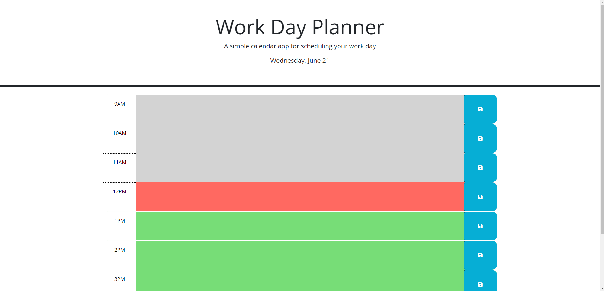

# Work Day Planner

## Description

A calendar application that allows a user to save events for each hour of a typical working day (9am-5pm).

## Screenshot

## Link to Deployed Application

https://jacobpudwill.github.io/Work-Day-Planner/
